Below is a **concise but academically grounded overview** of Python’s historical development and its role in modern data workflows, tailored for instructional use.

---

# 1. Origins and Early Development (1980s–1990s)

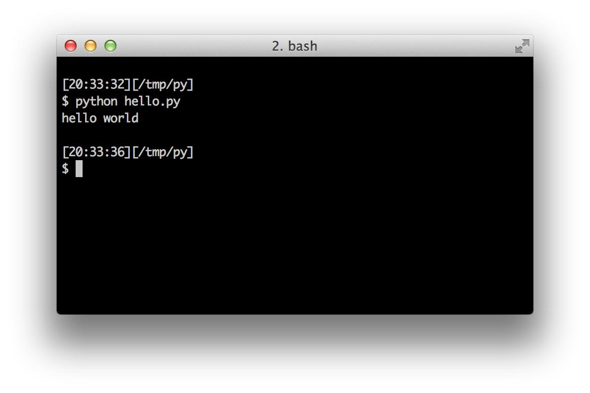

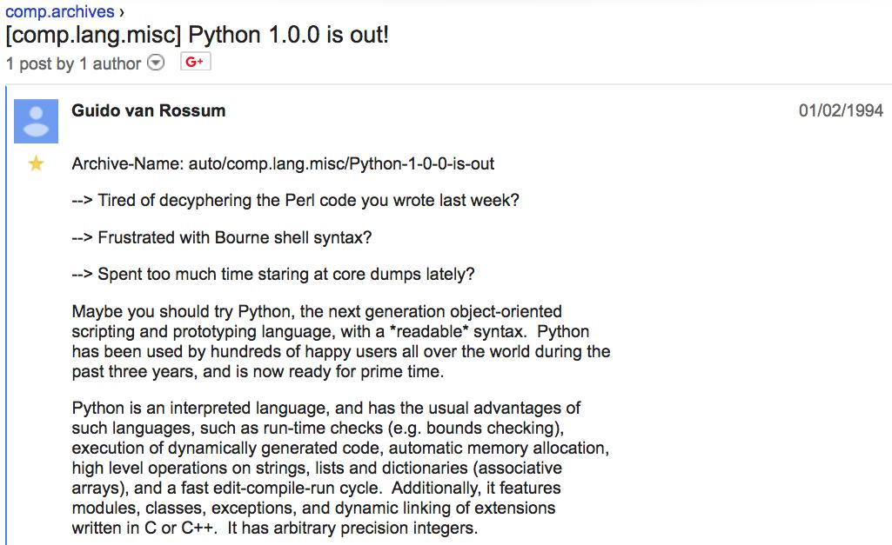

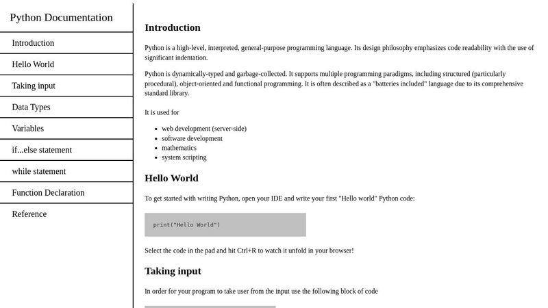

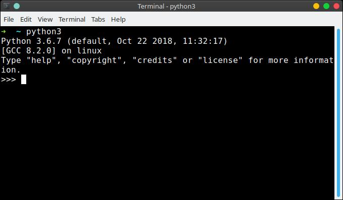

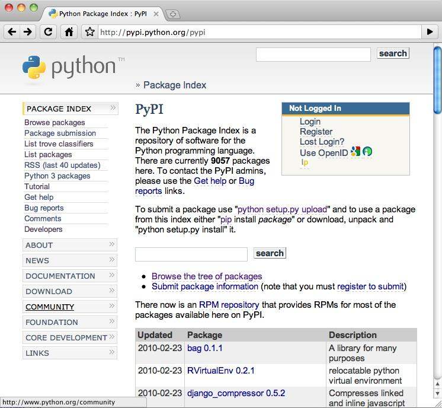

* **Creator:** Guido van Rossum
* **Start:** Late 1980s at CWI
* **Influence:** The ABC programming language

### Key milestones:

* **1991:** First public release of Python (version 0.9.0)
* **1994:** Python 1.0

  * Introduced: functions, exception handling, core data types
* **Design philosophy:**

  * Readability (“code as executable pseudocode”)
  * High-level abstraction
  * Batteries-included standard library

Python emerged as a **scripting and glue language**, designed to connect systems and automate workflows—this remains central today.

---

# 2. Consolidation and Growth (2000–2010)

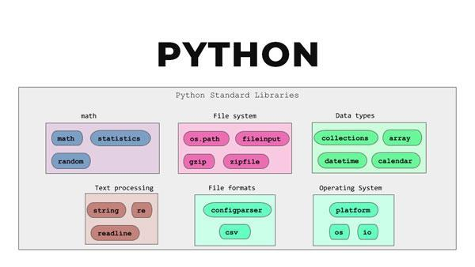

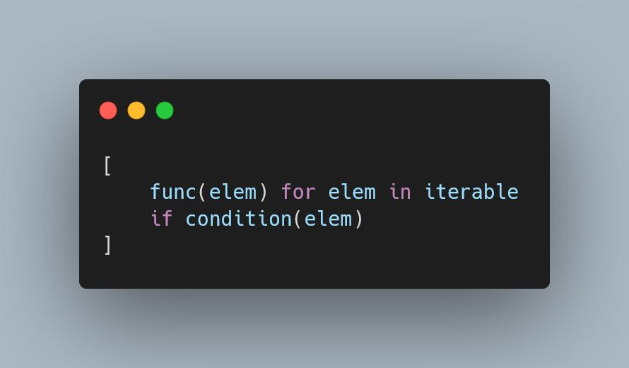

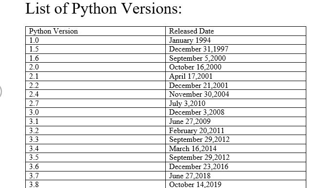

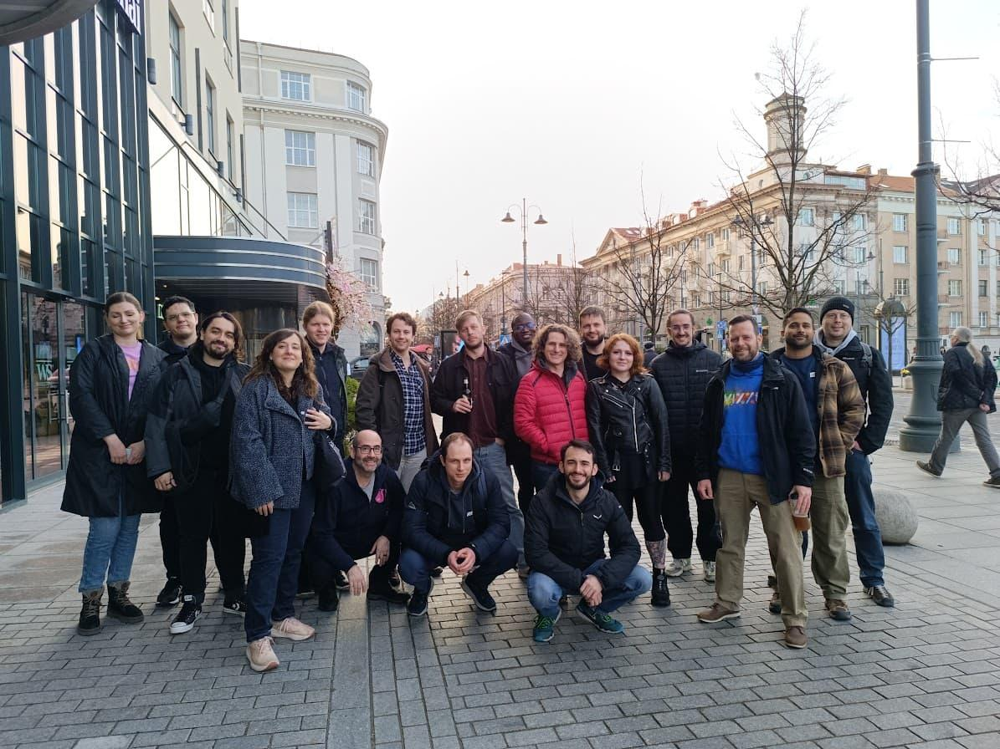

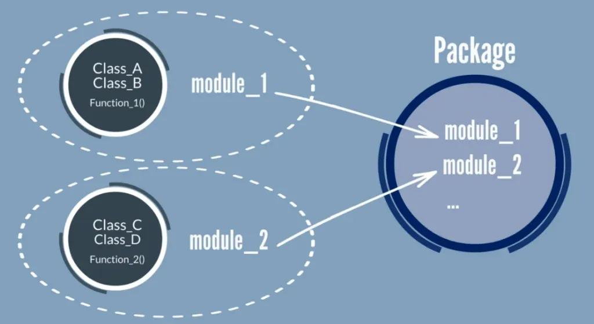

### Major events:

* **2000:** Python 2.0

  * Garbage collection
  * List comprehensions
* **2001:** Python Software Foundation established
* Expansion of:

  * Standard library
  * Cross-platform adoption
  * Web development (e.g., early frameworks like Django)

### Problem:

* Python 2 accumulated inconsistencies (Unicode, division behavior)

---

# 3. Modern Python Era (2010–Present)

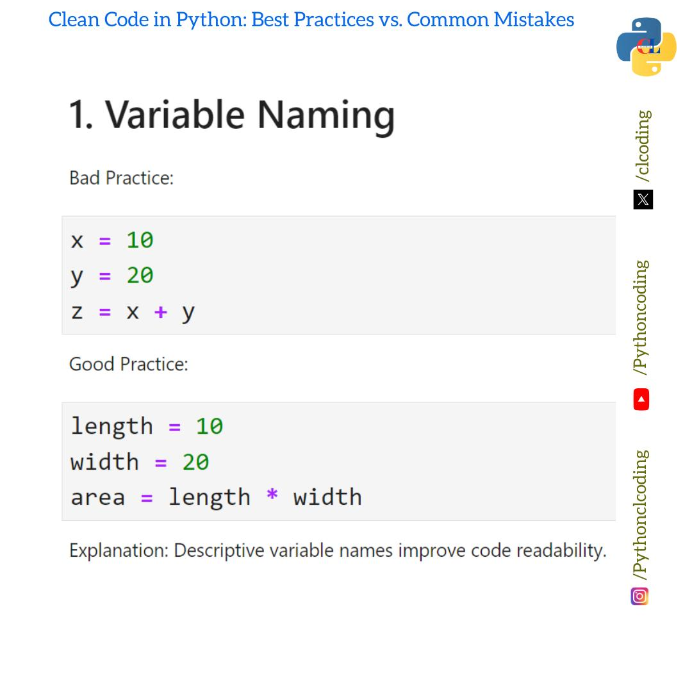

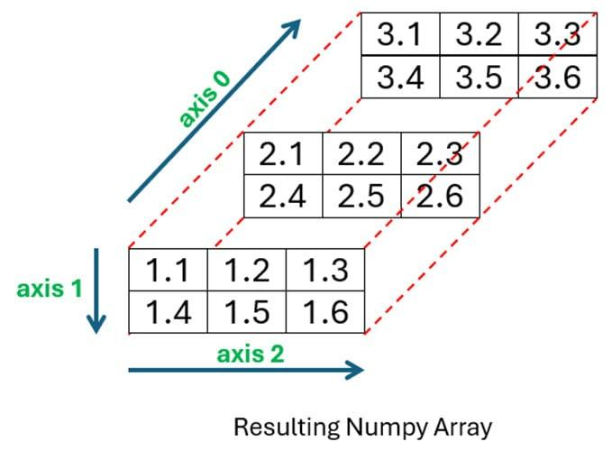

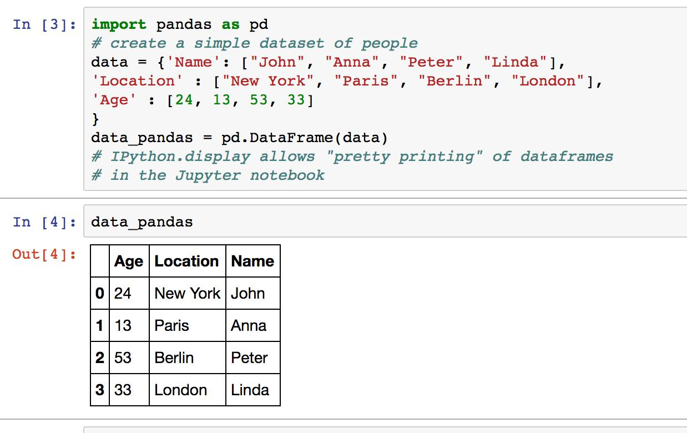

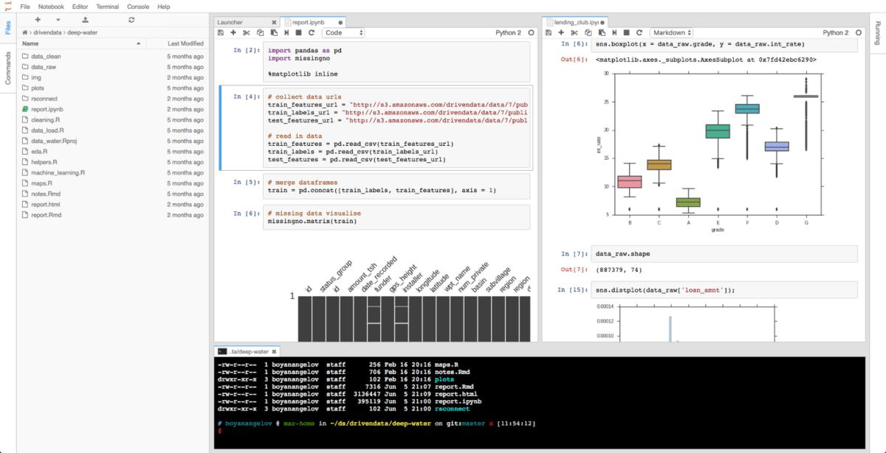

### Key transition:

* **2008:** Python 3.0 released

  * Breaking changes to fix design flaws
* **2020:** End of life for Python 2 → full ecosystem migration

### Ecosystem explosion:

* Scientific computing:

  * NumPy
  * SciPy
* Data analysis:

  * pandas
* Visualization:

  * Matplotlib
* Interactive computing:

  * Jupyter Notebook

### Key characteristic shift:

Python moved from a **general scripting language → dominant data science and AI language**

---

# 4. Python in Modern Data Processing Workflows

Python is now a **central orchestration layer** in data pipelines.

## 4.1 Core Role: “Glue + Processing + Analysis”

Python integrates:

* Databases (SQL, APIs)
* File systems (CSV, Excel, JSON)
* Statistical analysis
* Machine learning pipelines

This directly aligns with real-world institutional needs:

* Data extraction, transformation, merging (ETL/ELT)
* Automation of recurring processes
* Data validation and quality checks
* Integration across systems and APIs
* Reproducible workflows 

---

## 4.2 Typical Data Workflow Architecture

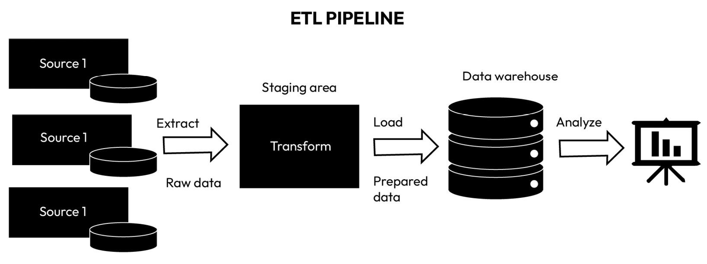

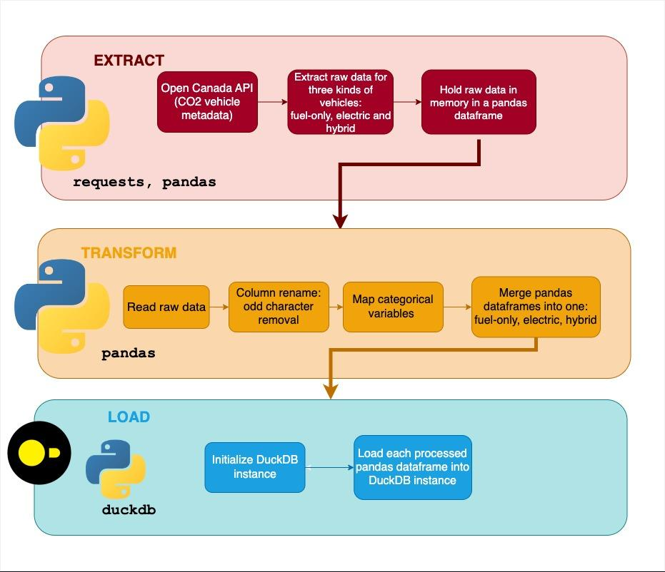

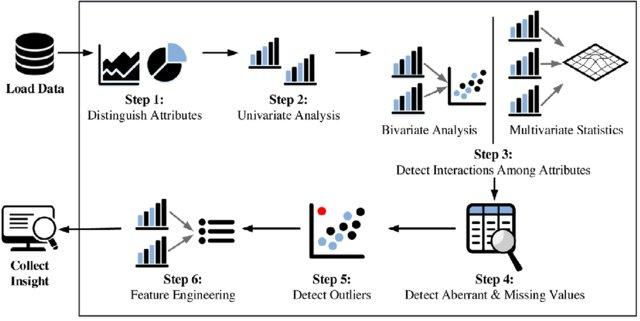

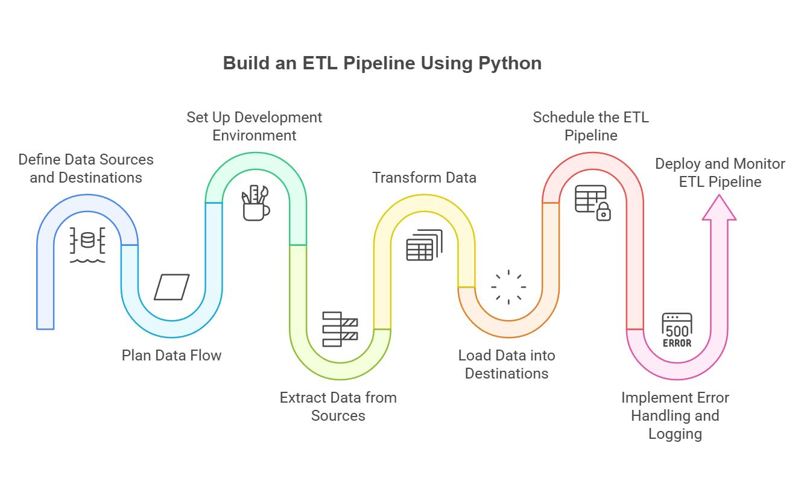

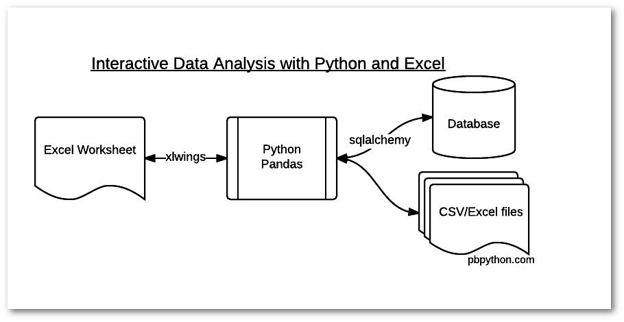

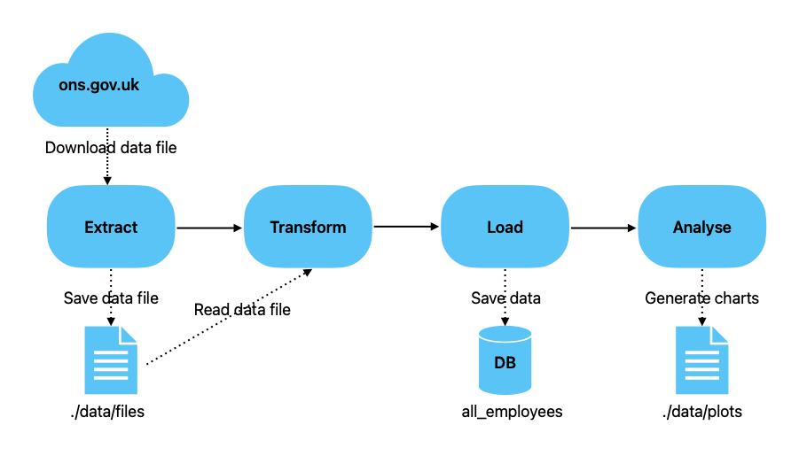

### Pipeline structure:

1. **Data ingestion**

   * SQL queries, APIs, files (CSV, Excel)
2. **Data transformation**

   * Cleaning, normalization (pandas)
3. **Validation**

   * Logical checks, consistency rules
4. **Analysis**

   * Aggregation, statistics, modeling
5. **Output**

   * Reports, dashboards, exports
6. **Automation**

   * Scheduled scripts, pipelines

---

## 4.3 Why Python Dominates Data Workflows

### Technical factors:

* Simple syntax → low cognitive overhead
* Large ecosystem → minimal reinvention
* Strong interoperability (C/C++/Java bindings)

### Organizational factors:

* Standardization of workflows
* Reproducibility (scripts, notebooks, Git)
* Easy onboarding for non-programmers (e.g., Excel users)

These directly address common institutional challenges:

* Data heterogeneity
* Lack of standardized pipelines
* Need for reproducibility and version control 

---

## 4.4 Python vs Alternatives

| Domain   | Python Role                      |
| -------- | -------------------------------- |
| Excel    | Automation + scaling             |
| SQL      | Querying + orchestration         |
| R        | Complementary (statistics-heavy) |
| Java/C++ | Performance-critical components  |

Python acts as the **integration layer across all of them**.

---

# 5. Conceptual Summary

Python’s evolution can be understood in three phases:

1. **1990s:** Scripting and readability-first design
2. **2000s:** General-purpose ecosystem growth
3. **2010s–2020s:** Dominance in data science, AI, and automation

### Current role:

Python is not just a programming language—it is a **workflow language for data-driven systems**.

---

# 6. Related Topics (for teaching expansion)

* Differences between Python scripts vs Jupyter notebooks
* ETL vs ELT architectures
* Python vs R in statistical workflows
* Reproducibility (virtual environments, Git)
* Scaling Python (Spark, Dask)
